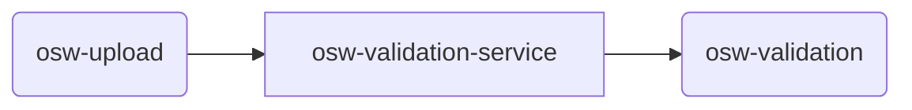

# TDEI-OSW-Validation

## Introduction 
Service to Validate the OSW file that is uploaded. At the moment, the service does the following:
- Listens to the topic _osw-upload_ for any new message (that is triggered when a file is uploaded)
- Consumes the message and checks the filename in the message
  - if the filename contains the word _valid_ returns **valid** as the result
  - if the filename contains the word _invalid_ returns **invalid** as the result
  - if the file name does not contain either, it will return **invalid** as the result
- Publishes the result to the topic _osw-validation_

## Getting Started
The project is built on top of NodeJS framework. All the regular nuances for a NodeJS project are valid for this.

### System requirements
| Software | Version|
|----|---|
| NodeJS | 16.17.0|
| Typescript | 4.8.2 |

### Build and Test
Follow the steps to install the node packages required for both building and running the application

1. Install the dependencies. Run the following command in terminal on the same directory as `package.json`
    ```shell
    npm install
    ```
2. To start the server, use the command `npm run start`
3. The http server by default starts with 8080 port or whatever is declared in `process.env.APPLICATION_PORT`
4. A `ping` with get and post. Make `get` or `post` request to `http://localhost:8080/health/ping`


### Connectivity to cloud
- Connecting this to cloud will need `.env` file with environment variables mentioned below.

### Environment variables
|Name| Description |
|--|--|
|PROVIDER | Provider for cloud service or local (optional) |
|QUEUECONNECTION | Queue connection string |
|STORAGECONNECTION | Storage connection string|
|PORT |Port on which application will run|
|UPLOAD_SUBSCRIPTION | Upload topic subscription name|
|UPLOAD_TOPIC | Upload topic name|
|VALIDATION_TOPIC | Validation topic name|
|AUTH_PERMISSION_URL | Authentication/Authorization url|
|VALIDATION_SUBSCRIPTION | set to test-osw-validation-subscription [test harness]|


### Messaging

This micro service deals with two topics/queues. 
- upload queue from osw-upload
- validation queue from osw-validation



#### Incoming
The incoming messages will be from the upload queue `osw-upload`.
The format is mentioned in [msg-osw-upload.json](https://github.com/TaskarCenterAtUW/TDEI-event-messages/blob/dev/event/osw-upload.json)

#### Outgoing
The outgoing messages will be to the `osw-validation` topic.
The format of the message is at [osw-validation.json](https://github.com/TaskarCenterAtUW/TDEI-event-messages/blob/dev/event/osw-validation.json)


### Test Harness
Test harness is written to test the end to end flow of OSW-validation. Test will read the test cases from [tests.json](./src/__test__/asset/tests.json) and simulate the upload queue request using payload data located at [osw_test_case*.json](./src/__test__/asset/test_data/) and parallel osw validation service which is running will subscribe to the queue messages and process the validation. 

#### Steps to run test harness

 1. Open the new terminal at the source root and execute below command
 ```
npm run start
```
This action will start listening to the queue messages for validation and publishes the results to the validation result topic.

2.  Open the second new terminal at the source root and execute below command
 ```
npm run test-harness
```
This action will simulate the queue messages as per the written test cases and will subscribe to the results published by validation service. we should see the test case result summary on the console. 